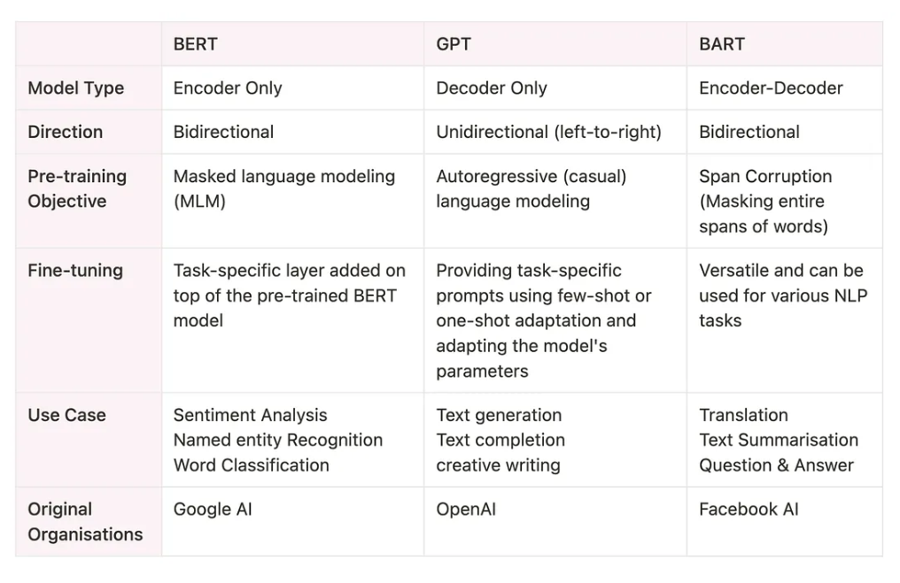

# BART (Bidirectional and Auto-Regressive Transformer)

## Overview
- BART = Bidirectional and Auto-Regressive Transformer.  
- Works as a denoising autoencoder for text generation and translation.  
- Developed by Lewis et al., 2019.  
- Combines BERT (bidirectional encoder) + GPT (autoregressive decoder).  
- Architecture = encoder–decoder network.  
- Uses masked language modeling for natural language generation.  
- Can be fine-tuned on small supervised datasets for domain-specific tasks.  

---

---

## BART (Bidirectional and Auto-Regressive Transformer) Architecture

- Encoder–Decoder model combining BERT (bidirectional encoder) and GPT (autoregressive decoder).  
- Parameters: ~140M (larger than BERT’s 110M and GPT-1’s 117M) → but more powerful.  
- Main task: Generate clean, coherent text from corrupted text.  
- Other tasks: Translation, summarization, question answering, paraphrasing, etc.  

### Encoder & Decoder
- **Encoder:** Bidirectional (like BERT) → creates embeddings for tokens + sentences.  
- **Decoder:** Autoregressive (like GPT) → predicts next token using past + encoder embeddings.  

### Core Blocks in BART

#### Multi-head Attention
- Predicts tokens with multiple parallel masks.  
- Examples:  
  - Whole sentence masked.  
  - Random words masked.  
- Parallel masking avoids error accumulation.  

#### Addition & Normalization
- Scales parameters into the same range.  
- Ensures uniform weight across layers.  

#### Feed-forward Layers
- Standard dense layers.  
- Process, store as weights, and pass information forward.  

---

## BERT Encoder Cell

### Input processing
- Takes tokenized text (preprocessing like lowercasing, stemming, stopword removal is optional and task-specific).  
- Each token is converted into embeddings (vectors).  

### Multi-head Attention
- Randomly masks some tokens.  
- Attention mechanism relates masked tokens to surrounding tokens.  
- Captures bidirectional context (left → right and right → left).  

### Add & Norm + Skip Connections
- The original input (clean tokens) is added to the processed masked tokens.  
- Normalization keeps values stable.  
- Skip connections ensure that both original info and processed info flow through the network.  

### Feed-forward Layer
- Standard dense neural layers refine embeddings further.  
- Adds and normalizes again to stabilize and preserve original + new info.  

### Output
- Produces embeddings that contain semantic meaning, masked info, and compressed context from the whole sentence.  
- Bi-directional design means info at the end of a sentence can influence the start, making embeddings context-rich.  

---

## GPT Decoder Cell

### Input
- Takes embeddings from the BERT encoder (already masked + processed).  

### Masked Multi-head Self-Attention
- Works sequentially, not in parallel.  
- Each token prediction can only depend on previous tokens (causal masking).  
- Learns how to decode masked embeddings into coherent tokens by paying attention to multiple embeddings.  

### Add & Norm + Feed-forward
- Adds processed embeddings to original embeddings, then normalizes.  
- Feed-forward layers refine outputs for better prediction.  

### Final Prediction Layer
- Generates predicted tokens step by step.  
- Output is compared with ground-truth clean text.  
- Errors are backpropagated through the entire encoder-decoder network.  

### Training Effect
- Trained on massive corpora of text.  
- Learns context, grammar, semantics.  
- Becomes good at predicting missing tokens (<MASK>) and cleaning corrupted text.  

---

## In Short
- **BERT Encoder** = Creates context-rich embeddings (by masking + bi-directional attention).  
- **GPT Decoder** = Sequentially predicts tokens from those embeddings (using autoregressive decoding).  
- **Together in BART** → input corrupted text → output clean, coherent text.

 
