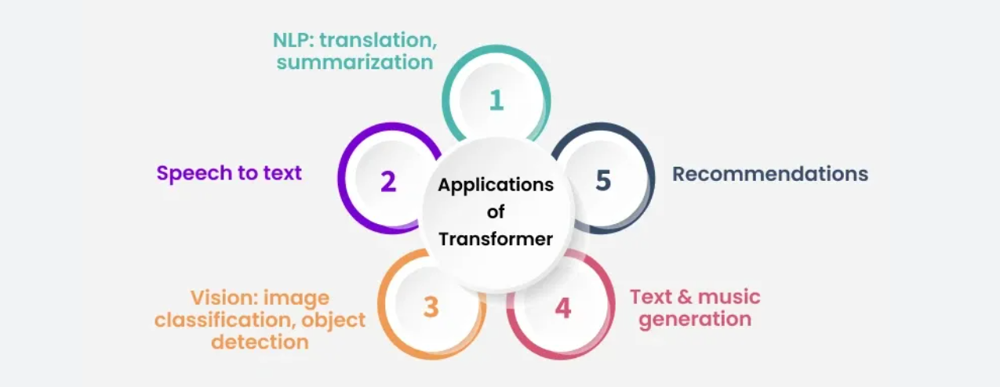
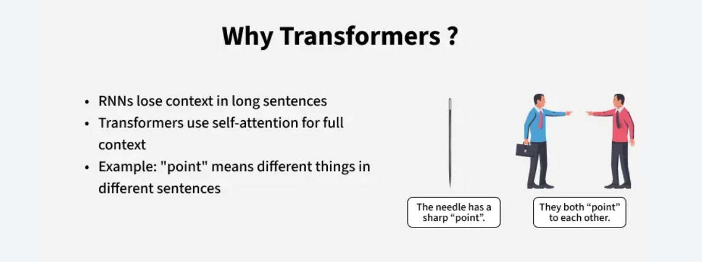

# Transformers 

## Introduction
- Transformers are a type of neural network architecture that transforms or changes an input sequence into an output sequence. 
- They do this by learning context and tracking relationships between sequence components. 

- Early deep learning models for natural language processing (NLP) tried to predict the next word based on the previous one.

- For example, your phone’s autocomplete suggests words based on frequent word pairs, like I am fine.

- Early machine learning (ML) models worked the same way, mapping word pair frequencies to guess the next word. But they couldn’t retain context for long inputs.

- For instance, they couldn’t generate a meaningful paragraph because they lost the link between the first and last sentence. 

- Transformer models solved this problem by handling long-range dependencies in text.

They can:

- Capture context across long sequences  
- Model relationships between all words, not just neighbors  
- Generate coherent paragraphs  

---

## Key Benefits

### Enable large-scale models
- Transformers process entire sequences in parallel, reducing training and processing time.
-  This made it possible to build large language models (LLMs) like GPT and BERT.
-  These models have billions of parameters, capture complex language patterns, and push AI toward more generalizable systems.

### Enable faster customization
- Transformers support techniques like transfer learning and retrieval-augmented generation (RAG).
- Models can be pretrained on massive datasets and fine-tuned on smaller, task-specific ones.
- This lowers resource needs, making advanced AI accessible to industries.
- They perform well across multiple domains and use cases.

### Facilitate multi-modal AI systems
- Transformers handle different data types together.
- For example, DALL·E generates images from text, combining NLP and computer vision.
- This enables AI systems that integrate diverse information and better mimic human understanding and creativity.

### Drive AI research and innovation
- Transformers sparked a new wave of AI research and applications.
- They inspired novel architectures, advanced machine understanding of language, and enabled real-world applications that improve customer experience and open business opportunities.

---

## Transformers Use Cases

- **NLP** – Summarize text, generate content, power assistants like Alexa.  
- **Translation** – Provide fast, accurate real-time language translation.  
- **DNA analysis** – Predict mutations, find disease regions, support personalized medicine.  
- **Protein analysis** – Model amino acid chains, predict 3D protein structures, aid drug discovery.  

---

## How Do Transformers Work?

### The problem with existing methods
Traditional neural networks that deal with data sequences often use an encoder/decoder architecture pattern. The encoder reads and processes the entire input data sequence, such as an English sentence, and transforms it into a compact mathematical representation. This representation is a summary that captures the essence of the input. Then, the decoder takes this summary and, step by step, generates the output sequence, which could be the same sentence translated into French.

This process happens sequentially, which means that it has to process each word or part of the data one after the other. The process is slow and can lose some finer details over long distances.

### Solution

Transformer models modify this process by incorporating something called a self-attention mechanism. Instead of processing data in order, the mechanism enables the model to look at different parts of the sequence all at once and determine which parts are most important. 

Imagine that you're in a busy room and trying to listen to someone talk. Your brain automatically focuses on their voice while tuning out less important noises. Self-attention enables the model do something similar: it pays more attention to the relevant bits of information and combines them to make better output predictions. This mechanism makes transformers more efficient, enabling them to be trained on larger datasets. Power modern NLP applications like translation, summarization, and chatbots.

---

## Components of Transformer Architecture

### Input embeddings
- Converts input into numbers the model can process.  
- Breaks input into tokens (e.g., words in a sentence).  
- Embeddings turn tokens into vectors that capture meaning and grammar.  
- Vectors can be seen as coordinates in an n-dimensional space.  
- Similar words (e.g., banana, mango) map close together.  
- Embeddings let the model learn relationships between words.  

### Positional encoding
- Transformers don’t process data in order by default.  
- Positional encoding adds signals to embeddings to show token order.  
- This helps the model understand sequence context.  

### Transformer block
Models are built from many stacked blocks.  
Each block has:  
- Multi-head self-attention → finds important relationships between tokens (e.g., “lies” meaning depends on speak vs. down).  
- Feed-forward network → processes outputs further.  

Blocks also include:  
- Skip connections → let information bypass layers.  
- Layer normalization → keeps numbers stable during training.  
- Linear transformations → adapt values for specific tasks (e.g., summarization vs. translation).  

### Linear and softmax layers
- Linear layer → maps internal vectors back to possible tokens. Produces scores (logits).  
- Softmax layer → converts logits into probabilities.  
- Final output = model’s confidence in each possible next token.  

---

## Types of Transformer Models

### 1. Bidirectional transformers (BERT)
- Process words in relation to all other words in a sentence.  
- Use masked language modeling (MLM): randomly hide tokens and predict them using context.  
- Look both left-to-right and right-to-left for better comprehension.  

### 2. Generative pretrained transformers (GPT)
- Use stacked transformer decoders.  
- Autoregressive: predict the next token based on all previous ones.  

### 3. Bidirectional and autoregressive transformers (BART)
- Combine BERT’s encoder (bidirectional) with GPT’s decoder (autoregressive).  
- Read full input sequence, then generate output one token at a time.  
- Useful for summarization, translation, and text generation.  

### 4. Transformers for multimodal tasks (e.g., ViLBERT, VisualBERT)
- Handle multiple input types like text + images.  
- Use dual-stream networks: process text and images separately, then fuse info.  
- Enable cross-modal tasks like visual question answering.  

### 5. Vision transformers (ViT)
- Adapt transformers for image classification.  
- Treat images as sequences of patches instead of pixel grids.  
- Use embeddings + positional encodings to capture spatial relationships.  
- Self-attention links patches across the whole image.  

---

## Transformers vs. RNNs
- RNNs: Process tokens one by one, use hidden state, good for short sequences, but slow and struggle with long dependencies.  
- Transformers: Process full sequence in parallel, use self-attention + positional encoding, faster, scalable, handle long-range context better.  

---

## Transformers vs. CNNs
- CNNs: Best for grid data (images), capture local patterns with filters, efficient in vision tasks.  
- Transformers: Built for sequences, now adapted for vision (ViT) by treating images as patch sequences.  

---

